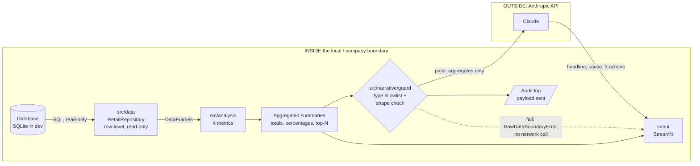

# Retail Pulse: architecture

Audience: a technical reviewer who did not take part in the build. This document explains what
the system does, how data flows through it, how the data-boundary rule is enforced, how
configuration works across environments, which decisions were made and why, and what is not
yet done. For setup and run instructions see the [README](../README.md).

Contents: [1 Purpose](#1-purpose-and-scope) - [2 Data flow](#2-data-flow) -
[3 Layers](#3-layers) - [4 Data boundary](#4-the-data-boundary-rule) -
[5 Environments](#5-environment-and-configuration-strategy) - [6 Metrics](#6-metric-definitions) -
[7 Reliability](#7-error-handling-and-reliability) - [8 Testing and CI](#8-testing-and-ci) -
[9 Decisions](#9-design-decisions) - [10 Limitations](#10-known-limitations-and-open-items) -
[11 Extending](#11-extending-the-system)

---

## 1. Purpose and scope

Retail Pulse converts weekly transaction data into a short analyst report: a headline, the likely
cause, and three recommended actions. It replaces "an analyst interprets the dashboard" with a
generated first draft that a person still reviews.

**In scope and built:** a synthetic data generator, a data access layer, four metrics, a Claude
integration with an enforced data boundary, a Streamlit UI, tests, and CI.

**Deliberately not built:** the optional `src/api` backend (the UI calls the layers directly), a
Dockerfile, and any non-SQLite data source. These belong to later deployment stages.

## 2. Data flow

Reading the diagram:

1. The database is queried through the data layer only. Row-level data (baskets, line items,
   household identifiers) exists only inside the boundary.
2. The analysis layer reduces it to summary objects: a few dozen numbers and short lists.
3. The UI shows the summaries directly as metric cards. This path never involves the API.
4. To write a report, the summaries pass through the guard. Only what passes is sent to Claude,
   and the exact payload is written to an audit log first.
5. The report comes back and is validated (exactly three actions, no empty fields) before display.

## 3. Layers

Dependencies point one way: `ui -> narrative -> analysis -> data`. The UI imports only
`src.analysis`, `src.narrative` and `config`; a test enforces that.

### Data (`src/data/`)
- `DataSource` (abstract): `read(sql, params)` and `ping()`. Named `:param` placeholders.
- `SQLiteDataSource`: opens a short-lived, **read-only** connection per query, so the app can
  never modify the database and no handle can leak or be shared across Streamlit threads.
- `RetailRepository`: one typed method per table (`get_txn_hdr`, `get_txn_itm`, `get_upcs`,
  `get_stores`, `get_lookup_days`, `get_household_segmentation`, `get_promos`). Filters are bound
  parameters, never string-built; an empty filter list matches nothing instead of everything.
- `factory.get_repository()` picks the backend from `RETAIL_PULSE_DB_URL`. This is the only place
  that maps a URL scheme to an implementation.
- Errors are translated to `DataAccessError` subclasses so callers never see `sqlite3` types.

### Analysis (`src/analysis/`)
Four functions, each taking a repository, a week and an optional region and returning a small
frozen dataclass (see [section 6](#6-metric-definitions)). `service.py` is a thin facade the UI
uses: `available_weeks()`, `available_regions()` and `analyze_week()`, which bundles all four
metrics and converts data-layer errors to `AnalysisError`. It exists so the UI never imports the
data layer.

### Narrative (`src/narrative/`)
- `guard.py`: the data-boundary enforcement ([section 4](#4-the-data-boundary-rule)).
- `generator.py`: `NarrativeGenerator.generate(summaries)`. The only module that imports the
  Anthropic SDK. Requests a JSON report through a JSON schema, validates it, retries, and maps
  every failure to a `NarrativeError` subclass.
- `prompts.py`: the system prompt (use only the given figures, treat causes as hypotheses, say
  when a comparison is unavailable) and the output schema.

### UI (`src/ui/app.py`)
Week and region selectors, four metric cards (total sales, suspected stockouts, promo unit lift,
top segment), an expandable detail table set, and the report. The report is generated **on
demand by a button**, not on every widget change, because each one is a paid call. An expander
shows exactly what would be sent to Claude.

### Config (`config/settings.py`)
See [section 5](#5-environment-and-configuration-strategy).

## 4. The data-boundary rule

> Raw records never reach the Claude API. Only pre-aggregated summaries do.

This is enforced in code at the one place data can leave: `NarrativeGenerator.generate`. The guard
runs **before any client is created or any network call is made**, so a violation cannot leak a
partial request.

### What is enforced

**Layer 1: type allowlist (`to_payload`).** The only accepted inputs are the four summary types
produced by `src.analysis`, one of each at most. A DataFrame, a raw dict, a list of records or any
other object raises `RawDataBoundaryError`.

**Layer 2: shape check (`assert_aggregated_only`).** The summary is converted to a plain dict and
inspected, so a future change that puts row-level data inside a legitimate summary type is still
caught:

| Check | Limit |
|---|---|
| Identifier-like keys (`household_id`, `basket_ids`, `customer`, `loyalty_*`, `trans_time`, `store_id`, or any key that is or ends in `id`/`_id`/`_ids`) | Rejected. Counts such as `n_households` are allowed |
| Lists of dicts or lists | At most 25 items |
| Lists of numbers or strings (ID-list shape) | At most 10 items |
| Non-JSON values (DataFrames, arrays, custom objects) | Rejected |
| Nesting depth | At most 6 levels |
| Total payload size | At most 30,000 characters (the real four-summary payload is about 5 KB) |

**Audit.** The exact payload is logged to the `retail_pulse.narrative.audit` logger before the
call. Raw records are never logged because they never get that far.

**Transparency.** The UI has an expander showing the same payload, so a reviewer can see what
would be sent.

### What a summary contains

Totals and percentage changes by department and region; counts and top-N lists of suspected
stockout SKUs (product code, department, brand, number of stores affected, estimated sales at
risk); promo lift figures by promo type; and per-segment basket statistics. No household
identifiers, basket identifiers, timestamps or line items.

### What this does and does not guarantee

It guarantees that no record-level data structure is sent. It is a structural defence, and it is
heuristic in the sense that it recognises row-like shapes and names. It does **not**:

- judge whether an *aggregate* is commercially sensitive (sales by region and department are still
  business information; the Anthropic account and data-handling terms govern that);
- apply small-group suppression. A segment with very few households would be reported with its
  count. With real data a minimum group size should be added before staging/production;
- replace review. The limits above are deliberately tight for today's summaries; if a legitimate
  summary needs more, raise the limit in `guard.py` on purpose.

## 5. Environment and configuration strategy

All configuration comes from environment variables, loaded once by `config/settings.py` into an
immutable `Settings` object. A local `.env` file (gitignored) is read only as a development
convenience.

| | dev | staging | prod |
|---|---|---|---|
| Data | Synthetic only | Masked or sampled real data, if approved | Real, aggregated-only to the API |
| Database | Defaults to local `sqlite:///./local_dev.db` | `RETAIL_PULSE_DB_URL` **required** | `RETAIL_PULSE_DB_URL` **required** |
| Claude API key | Optional (the report button shows a warning without it) | **Required** | **Required**, company account only |
| Log level default | `DEBUG` | `INFO` | `WARNING` |
| Selected by | `RETAIL_PULSE_ENV=dev` (the default) | `staging` | `prod` |

**Fail fast.** Staging and prod raise `ConfigError` at startup if the database URL or API key is
missing. There is no path by which a non-dev environment falls back to the synthetic database.
The synthetic data generator likewise refuses to run outside dev.

**Secrets.**
- Never in code and never in git. `.env`, keys, certificates, databases, CSVs and logs are
  gitignored at both the repository root and the project folder; only `config/.env.example`
  (blank placeholders) is tracked.
- `Settings.__repr__` masks the API key and the password in a database URL, so neither appears in
  logs or tracebacks. Error messages for unsupported URLs print only the scheme.
- In production the intended source is a secrets manager injecting environment variables; the code
  already reads only from the environment, so no change is needed to adopt one.

**Deployment path** (each stage is its own explicit decision): dev on synthetic data -> demo on
synthetic data -> staging on masked/sampled data with IT/Security sign-off -> production on real
data, aggregated-only, with formal internal approval.

## 6. Metric definitions

Full business logic is in each function's docstring, written for review by someone with retail
domain knowledge. Summary:

| Metric | Definition | Key choices |
|---|---|---|
| **Weekly sales change** (`sales.py`) | Sum of line-item `sales_value` for the week vs the prior week, by department, by region and by department x region | "Sales" is net of shelf/promo discounts but **before coupons**. Top movers are ranked by absolute dollar change. The first week has no prior, so changes are `None`, not zero |
| **Stockout detection** (`stockouts.py`) | A store-SKU that normally sells but sold zero this week | Inferred from sales, since there is no inventory data. Baseline is the **median** weekly units over the prior 8 weeks, excluding promo weeks. Two tiers: a store's own baseline >= 15 units, or a SKU that is zero across a whole region whose combined baseline is >= 15. Needs >= 3 weeks of history |
| **Promo lift** (`promo.py`) | Promoted units and sales vs the same store-SKU's own non-promo baseline | Baseline = mean weekly units over non-promo weeks in the prior 8 (missing weeks count as zero), at least 3 such weeks. Volume-weighted. `sales_lift` is lower than `unit_lift` because sales are net of the discount. No adjustment for cannibalisation or post-promo dips |
| **Segment basket behavior** (`segments.py`) | Per household segment: baskets, households, average basket value and its change vs prior week, items per basket, promo share of items, share of sales | Basket value is net of promo discounts and coupons. Item counts are line items, not units |

## 7. Error handling and reliability

- **Data layer.** Missing database, bad SQL and unsupported backends raise `DataSourceUnavailableError`,
  `QueryError` and `UnsupportedDataSourceError` (all `DataAccessError`).
- **Analysis.** Unknown week or region raises `AnalysisError`; empty situations (first week, no
  promos, too little history) return well-formed empty summaries with explicit flags such as
  `has_prior_data`, `has_promos`, `has_history`.
- **Narrative.** The SDK retries 429, 5xx, timeouts and connection errors (3 retries, 60-second
  timeout). A malformed report (bad JSON, empty fields, not exactly 3 actions) is re-requested
  once. Authentication, permission, not-found, bad-request, rate-limit, refusal, truncation and
  connection failures all surface as `NarrativeGenerationError` with a readable message; no SDK
  exception type escapes.
- **UI.** Every failure becomes a message on screen. A missing key is a warning, not a crash.

## 8. Testing and CI

The suite (161 passing tests, plus 1 live test that is skipped without a key) builds its own
seeded synthetic database in a temp folder. It does not use `local_dev.db`, the network or an API key.

- **Unit tests** cover the analysis functions against an **answer key** written by the generator
  (`dev_ground_truth`): the planted stockout must be found in the right region and weeks with no
  false alarms elsewhere; a normal week; the first week (no prior data); a promo-free week. Totals
  are cross-checked against independent SQL, and the promo lift against a from-scratch
  recalculation. Also: data layer, guard, generator retries/errors, and settings.
- **Integration tests** run the whole pipeline with Claude replaced by a stand-in that writes its
  report from the payload it receives. They assert key terms (region, "stock", department) and that
  figures in the report match the analysis, never exact wording; and that no row-level data
  reaches the model. UI tests drive the Streamlit app headlessly and enforce the layering rule.
- **Live test** (`pytest -m live`) calls the real API and checks key terms. It has not yet been run.
- **Mutation check.** During development the code was deliberately broken nine ways (for example a
  noisier stockout threshold, a wrong prior week, a disabled guard rule); every break was caught.
- **CI** (`.github/workflows/ci.yml`) runs `ruff check` and `pytest` on Python 3.10 and 3.12 for
  pushes and pull requests. The workflow file sits at the git root because that is where GitHub
  reads it; jobs run inside `retail-pulse/`.

## 9. Design decisions

| Decision | Why |
|---|---|
| Summaries as frozen dataclasses, not DataFrames | Makes "no raw rows past the analysis layer" a property of the types, and gives the guard something to allowlist |
| `DataSource` interface with SQL text and `:name` parameters | Lets a warehouse replace SQLite by adding one class and one URL scheme |
| Read-only, connection-per-query SQLite | Cannot modify data; no leaked handles; safe under Streamlit's threads |
| Two-tier stockout detection | At store level the synthetic data is too sparse to tell a stockout from chance at any threshold that avoids false alarms. Zero across a whole region is far stronger evidence. The output is still per store and SKU. The threshold of 15 was tuned on synthetic data (10 gave false alarms in 5 of 45 normal weeks; 15 gave none) |
| `analysis/service.py` facade | The UI may only call analysis and narrative, but needs week/region choices and a repository. The facade supplies them without the UI touching the data layer |
| JSON-schema output plus client-side validation | The schema constrains the format; "exactly three actions" is checked in code |
| Report on demand | Each report is a paid call; widget changes should not trigger spend |
| Synthetic answer key in the dev database | Lets tests assert detection against known truth. The table exists only in the dev database |
| Default model `claude-sonnet-5` | A cost/quality starting point, configurable with `RETAIL_PULSE_MODEL`. A more capable, more expensive model may be preferable for report quality and should be evaluated |

## 10. Known limitations and open items

- The Claude request has not been run against the real API; only against a test double.
- CI is configured but has not yet run on GitHub; Python 3.10 has not been exercised.
- Synthetic data only. Metric thresholds, especially the stockout baseline, need re-tuning on real
  volumes, and the synthetic data is sparser per store-SKU than a real chain would be.
- Stockouts are inferred from sales. With inventory or on-shelf-availability data, detection would
  be direct and much more reliable.
- No small-group suppression in summaries (see [section 4](#what-this-does-and-does-not-guarantee)).
- Promo lift ignores cannibalisation, halo and post-promo dips; it is a demand-response measure,
  not incremental profit.
- Only a SQLite backend exists. Staging and production need a warehouse `DataSource`,
  IT/Security sign-off and a secrets-manager deployment.
- Report wording quality has not been reviewed by a retail domain expert against real numbers, which
  is on the senior-review checklist in the setup guide.

## 11. Extending the system

**Add a data source (for example a warehouse).** Subclass `DataSource` in `src/data/source.py`
implementing `read` and `ping` (translate driver errors to `src.data.errors`), then register its URL
scheme in `_BUILDERS` in `src/data/factory.py`. Nothing above the data layer changes.

**Add a metric.** Write a function in `src/analysis/` returning a new frozen dataclass; add the
dataclass to `ALLOWED_SUMMARY_TYPES` in `src/narrative/guard.py` (this is the deliberate, reviewable
step that lets it reach the API); include it in `analyze_week` and the UI; add tests against the
planted data.

**Change what may be sent.** Adjust the limits or key patterns in `guard.py`. Treat any loosening
as a security-relevant change and review it as such.
